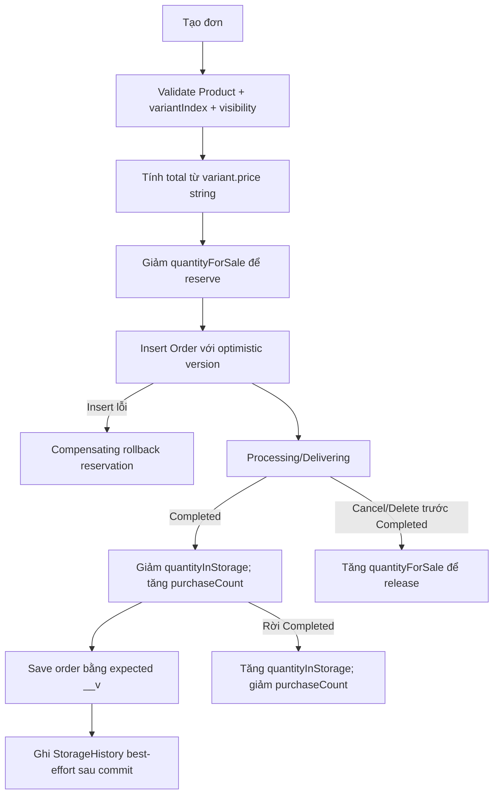
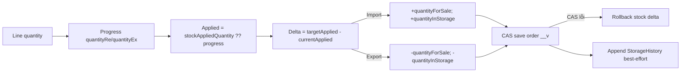
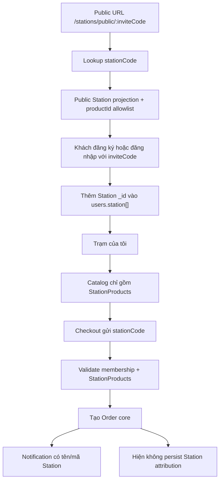
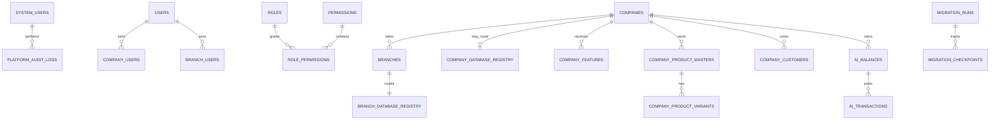
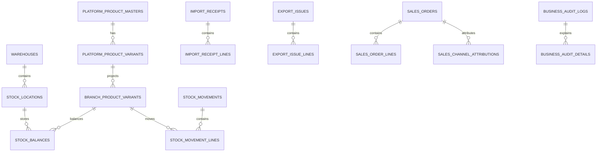
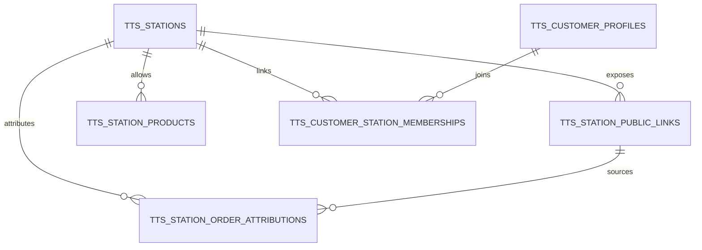

# Khảo sát MongoDB và kiến trúc dữ liệu đích SQL Server

> Cập nhật ownership ngày 2026-08-14: tài liệu này giữ giá trị kiểm kê code/contract, nhưng kiến trúc cũ coi `[TTSmart]` chủ yếu là Station/storefront không còn đúng. `[TTSmart]` được xác nhận là database bán hàng đầy đủ. Phương án thay thế được ghi tại `TTSMART_CODE_AND_DATA_DISCOVERY.md` và `SQLSERVER_TTSMART_SCHEMA_DESIGN.md`.

## 1. Phạm vi, baseline và giới hạn bằng chứng

Đây là khảo sát read-only để chuẩn bị giai đoạn MongoDB → SQL Server sau Đợt 1. Không sửa runtime, không tạo DDL/migration/EF model/database/seed, không kết nối production, không đọc `.env`, secret, token, upload hoặc log nhạy cảm, không commit/push/deploy.

| Nguồn | Baseline khảo sát | Phạm vi đọc |
|---|---|---|
| Legacy `D:\TTSmartEcomWeb` | branch `TTSmartEcom_Deploy`, commit `c836c8122e5d0e28628235b8e0f44c1c718efb91`; dirty worktree có sẵn được giữ nguyên | Mongoose model, component/router, controller, service, validator, test và consumer FE/AD |
| V2 `D:\TTSmartEcomWeb_v2` | branch `main`, commit `1ff5058996775d28f97ba0702ef14f02b7a8ece8`; dirty worktree có sẵn được giữ nguyên | Mongo document/class-map, repository, Application service, API controller/contract, unit/contract/integration/security test và fixture BSON |
| SQL Server local | `DESKTOP-5O6VV3J\SQLEXPRESS`; read-only metadata | `dangnhap.net`, `hiephung2_online`, `petro8_online`; table/column/key/index/object hash/row allocation, không đọc row nghiệp vụ |

Source code là nguồn sự thật về hành vi. 21 collection được suy ra từ Mongoose và có document class V2 tương ứng. Fixture tổng hợp chứng minh một số lát cắt BSON, không chứng minh dữ liệu production. Profile snapshot local `Ecom` được chủ dự án cho phép ngày 2026-08-14 được ghi riêng tại `MONGODB_ECOM_DATA_PROFILE_AND_SQLSERVER_DECISIONS.md`.

### 1.1 Data profile thực tế

Đã profile read-only MongoDB local `127.0.0.1:27017/Ecom`, server 8.0.26, theo quyền rõ ràng của chủ dự án. Snapshot có 19 collection và 1.503 document. Chỉ ghi thống kê tổng hợp, không xuất document/PII/credential. Kết quả chính:

- bốn collection drinks suy ra từ source không tồn tại;
- có thêm `autologintokens` rỗng và ba `chatmessages` không còn model/consumer trong source hiện tại;
- Product/catalog, order/import/export, tồn, User/Station, kiểu BSON, duplicate/orphan, array distribution và index vật lý đã được profile;
- 18 line import/export và 56 stock history tham chiếu Product không còn tồn tại;
- `storagehistories` không đủ làm nguồn dựng opening balance;
- index usage/query plan và selectivity dưới tải thật vẫn **`NOT VERIFIED`**.

Chi tiết và quyết định DDL nằm tại `MONGODB_ECOM_DATA_PROFILE_AND_SQLSERVER_DECISIONS.md`. Đây là snapshot local được quan sát, không tự động đại diện production.

### 1.2 Bằng chứng fixture hiện có

- `LegacyMongoBsonFixtureTests`: Product/variant giữ extra element; phân biệt missing với explicit null; Order giữ `images`, `__v` và extra field; cart item giữ `_id`; Section giữ field viết hoa `Section` và `imgUrl`.
- `InventoryOrderMixedProductIdBsonTests`: line import/export đọc được `productId` BSON string hoặc ObjectId nhưng khi ghi tương thích dùng string.
- `StorefrontPolicyBsonParityTests`: policy đa ngôn ngữ và timestamp có rule tương thích riêng.
- Integration Mongo biệt lập chỉ bao phủ query ActivityLog, aggregation inventory summary và guard SuperAdmin chọn lọc; không bao phủ đủ 21 collection hoặc mọi đường ghi.

## 2. Data dictionary 21 collection

Quy ước: `R` required thật; `O` optional/may be missing; `N` default null; `D(x)` default. Mongoose `require` viết sai không tạo required validation. Mọi root có `_id:ObjectId`; subdocument có `_id:ObjectId` trừ khi `_id:false`. Index dưới đây là index **khai báo trong source**, không phải index server đã xác minh.

### 2.1 `activitylogs` — `ActivityLog` / `ActivityLogDocument`

- Source: `be/models/activitylog.js`; V2 `ActivityLogDocument`; repository `MongoAuditRepository`.
- Fields: `userName:String R`; `action:String R`; `productId:ObjectId O ref Product`; `productName:String O`; `details[]{field:String O,oldValue:String D(""),newValue:String D("")}`; timestamps.
- Read/write: `GET /activity-logs`; mutation product/catalog/storefront/station/provider/user ghi audit best-effort.
- Index: TTL `{createdAt:1}` 7,776,000 giây (90 ngày).
- Phân loại: Core audit framework, nhưng record/action Station và storefront TTS phải route sang extension audit khi migrate.
- Rủi ro: actor chỉ là tên snapshot; before/after mất type; TTL có thể xóa bằng chứng; PII/secret phải redact.

### 2.2 `brands` — `Brand` / `BrandDocument`

- Fields: `Brand:String O` (`require` sai); không timestamps.
- Read/write: `/chips/brands`; `MongoCatalogRepository/MongoCatalogWriteRepository`; Product lưu brand bằng string.
- Index: chỉ `_id`; không unique/canonical key.
- Phân loại: Core catalog.
- Rủi ro: duplicate theo hoa/thường/dấu/khoảng trắng; rename không FK.

### 2.3 `chips` — `Chip` / `ChipDocument`

- Fields: `Color:String[]`, `Shapes:String[]`, `Frames:String[]`, `ButtonCount:String[]`; `require` sai; xử lý như singleton.
- Read/write: `/chips/addValue`, `/removeValue`, `/getValues`, `/:name/value`; catalog repositories.
- Index: chỉ `_id`; không enforce singleton/unique array value.
- Phân loại: Core catalog legacy attribute vocabulary.
- Rủi ro: field được chọn động bằng tên; value không ID ổn định; cần map sang AttributeDefinition/Value.

### 2.4 `sections` — `Section` / `SectionDocument`

- Fields: `Section[]{name:String R,value:String[] D([]),imgUrl:String O}`; subdocument `_id`; không timestamps.
- Read/write: `/chips/section*`, `/sections/images`, `/:name/value`; media URL được transform về path tương đối.
- Index: chỉ `_id`.
- Phân loại: Core catalog classification/attribute; hình ảnh storefront có thể là commerce extension.
- Rủi ro: Product tham chiếu `section/value` bằng string; rename mềm; URL tuyệt đối/tương đối.

### 2.5 `drinks` — `Drink` / `DrinkDocument`

- Fields: `drinkName:String`, `drinkPrice:Number`, `drinkImg:String`, `toppings:String[]`.
- Route `/drink` tồn tại trong `components/drink.js` nhưng router không mount.
- Index: chỉ `_id`. Phân loại: Dormant/legacy. Rủi ro: tiền Number, topping bằng tên.

### 2.6 `drinktoppings` — `DrinkToppings` / `DrinkToppingsDocument`

- Fields: `toppingNames:String`, `toppingPrice:Number`; route dormant `/topping`; chỉ `_id`.
- Phân loại: Dormant/legacy; không đưa vào Core khi chưa có quyết định.

### 2.7 `drinkbills` — `DrinkBill` / `DrinkBillDocument`

- Fields: `detail[]{staff,drinkImg,drink,toppings:String,drinkPrice:Number,status:Boolean}`; `billTotal:Number`; `billStatus:Boolean`; timestamps.
- Route dormant `/bill`, update item bằng array index; chỉ `_id`.
- Phân loại: Dormant/legacy. Rủi ro: tiền Number, snapshot tên, index mảng không ổn định.

### 2.8 `drinkowelists` — `DrinkOwelist` / `DrinkOweListDocument`

- Fields: `staffID:String`, `bank:Number`; chỉ thấy model, không consumer runtime mount; chỉ `_id`.
- Phân loại: Dormant/không đủ bằng chứng; semantics và đơn vị `bank` chưa biết.

### 2.9 `iporders` — `IpOrder` / `IpOrderDocument`

- Header: `orderName:String D("")`, `note:String D("")`, `userName:String R`, `images:String[]`, `total:String D("0")`, `status:Boolean D(false)`, `completedAt:Date N`, timestamps, `__v` optimistic concurrency.
- Line: `status:Boolean`; `productId:String O` nhưng đọc tương thích ObjectId/string; `price:String`; `unit:String`; `quantity:Number D(0) min 0`; `quantityRe:Number D(0) min 0`; `stockAppliedQuantity:Number O`; `note:String`; `vat:String D("")`; subdocument `_id`.
- Read/write: `/iporders/orders*`, line/status/reorder/media; `InventoryOrderService`, `MongoInventoryOrderRepository`.
- Index: chỉ `_id` trong schema.
- Phân loại: Core WMS import/receipt candidate.
- Rủi ro: total/price string locale; `quantityRe` là progress nhập; hook total không chạy trên mọi update trực tiếp; multi-document stock/history không transaction.

### 2.10 `eporders` — `EpOrder` / `EpOrderDocument`

- Header như import. Line: `status`, mixed `productId`, `price:String`, `importPriceSnapshot:String D("")`, `profitPercent:Number 0..100`, `unit`, `quantity`, `quantityEx`, `stockAppliedQuantity`, `stockUpdateSkipped:Boolean D(false)`, `note`, `vat`.
- Read/write: `/eporders/orders*`; cùng service/repository inventory.
- Index: chỉ `_id`. Phân loại: Core WMS export/issue candidate.
- Rủi ro: skip stock chỉ hợp lệ trong một số luồng AI/zero-stock; cost/profit snapshot; chưa có reason chuẩn; tiền string.

### 2.11 `manages` — `Manage` / `ManageDocument`

- Fields: `overViewImg[]`, `partners[]`, `displayPartners`; `footerContent{logo,description,address,phone,email}`; URL/introduction/mainPolicy; translations `{vi,zh,en}`; `policies[]` với sections/translations/timestamp; `homeCategoryConfig` với items/translations; `section1..section11` với name/translations/productId/display và phần lớn có image/link.
- Read/write: `/manages`, `/policies`, `/update*`, section/media routes; `MongoStorefrontRepository`.
- Index: chỉ `_id`; singleton không enforce.
- Phân loại: TTSmart-specific commerce/storefront extension theo bằng chứng hiện tại, không phải Core WMS.
- Rủi ro: object/mảng sâu, hai shape localization, 11 field cố định, product string reference, singleton không khóa.

### 2.12 `counters` — `Counter` / `CounterDocument`

- Fields: `id:String R unique`, `seq:Number D(0)`; V2 còn dùng `_id="__ttsmart_v2_superadmin_mutation_guard"` làm mutex.
- Consumer: cấp order code và guard duy nhất một SuperAdmin.
- Index: unique `id` + `_id`.
- Phân loại: mixed; order sequence thuộc Core transaction, SupAdmin guard thuộc Platform compatibility.
- Rủi ro: trộn allocator và lock; lock mồ côi; SQL phải tách sequence/unique constraint/transaction.

### 2.13 `orders` — `Order` / `OrderDocument`

- Fields: `orderCode:String O unique`; `userPhone:String D("")`; `userName:String`; `cartItems[]{productId:String,variantIndex:Number,quantity:Number}` (`require` sai); `total:Number R`; `status:String enum Processing|Delivering|Completed`; `payment:Boolean`; `state:String enum Processing|Cancelled`; `completedAt:Date N`; `images:String[]`; timestamps; `__v`.
- Read/write: `/orders*`; `SalesOrderService`, `MongoOrderRepository`, `MongoOrderStockPort`.
- Quan hệ: customer bằng phone snapshot; product string + variant array index. Không có station id/code trong persisted Order.
- Index: unique `orderCode`; snapshot local `Ecom` xác nhận `_id_` và unique `orderCode_1`, còn index production/query plan dưới tải thật chưa xác minh.
- Phân loại: Core Sales Order fields; website checkout/customer ownership/media là TTS commerce behavior; Station attribution phải ở extension.
- Rủi ro: line không snapshot SKU/name/price; total Number; variantIndex dễ lệch; station được dùng lúc tạo nhưng không lưu cùng order.

### 2.14 `products` — `Product` / `ProductDocument`

- Master: `type,name R`; `nameUnsigned` indexed; `display D(true)`; `code` sparse unique; `vat`; `adjusted`; `brand,section,value R`; warranty/content fields; timestamps.
- Variant: `price/importPrice:String`; `earn:Number D(25)`; image/attributes/note; `quantityForSale/quantityInStorage:Number D(0) min 0`; stable subdocument `_id` nhưng nhiều consumer dùng `variantIndex`.
- Documents: legacy `infoDoc{manual,dataSheet,catalog,others}`; `documents[]{label,url,sourceType}`.
- Reviews: `email R`, comment, rating 1..5, createdAt. Cached: `purchaseCount`, `totalRating`, `reviewCount`, `averageReviews`.
- Read/write: `/products*`; Product/Cart/Order/Inventory/Catalog repositories, AI/voice/media/review services.
- Index: `nameUnsigned`; sparse unique `code`; `_id`.
- Phân loại: Core Product/Variant master candidate; reviews/storefront presentation là optional commerce/TTS extension; stock fields phải rời Product master.
- Rủi ro: master+price+stock+review trộn; tiền string; extra BSON; missing/null; cached aggregate lệch; content có thể chứa HTML.

### 2.15 `types` — `Type` / `ProductTypeDocument`

- Fields: `Type:String R trim max120`, `icon:String O max120 custom validation`; timestamps.
- Read/write: `/products/types`; rename cập nhật Type, Products và Manage theo nhiều bước có application rollback.
- Index: chỉ `_id`; không unique Type.
- Phân loại: Core catalog type; icon/storefront presentation optional.
- Rủi ro: rename không atomic, collation duplicate.

### 2.16 `stations` — `Station` / `StationDocument`

- Fields: `stationName:String`, `imgUrl:String`, `stationCode:String R trim`, `allowPublicSignup:Boolean D(true)`, `location:String`, `productId:String[]`; virtual `inviteCode=stationCode`; không timestamps.
- Read/write: `/stations` CRUD/product/media; public `/public/:inviteCode`, `/code/:code`, `/by-codes`, `/by-ids`; `MongoStationRepository`; order/cart/user services.
- Index: chỉ `_id`; `stationCode` không unique trong schema dù là public lookup/invite.
- Phân loại: **TTSmart-specific Station extension tuyệt đối; không thuộc Core WMS, không phải Branch, không phải Customer.**
- Rủi ro: invite code như credential nhưng plaintext; public projection; duplicate code; no lifecycle; product reference string.

### 2.17 `storagehistories` — `StorageHistory` / `StorageHistoryDocument`

- Fields: `productId:ObjectId R ref Product`, `productName:String R`, `quantity:Number R signed`, `userName`, `orderId`, `orderName`, `note D("")`, `isAIScan D(false)`, `source` enum sáu giá trị, timestamps.
- Read/write: `/histories*`; stock/product/order/inventory services ghi history.
- Index: chỉ `_id` trong schema.
- Phân loại: Core stock audit/history candidate, nhưng chưa phải ledger đầy đủ.
- Rủi ro: không movement/idempotency/location/UOM/balance-after; order id string polymorphic; history write V2 là best-effort sau commit ở một số luồng.

### 2.18 `telegramconfigs` — `TelegramConfig` / `TelegramConfigDocument`

- Fields: `enabled`; `recipients[]{label,chatId R,type personal|group,enabled,notifyTypes[]}`; timestamps. Bot token từ environment.
- Read/write: `/telegram/settings|recipients|test`; provider settings repository.
- Index: chỉ `_id`; singleton không enforce.
- Phân loại: optional integration, **không đủ bằng chứng để coi là Core WMS**; hiện gắn notification TTS.
- Rủi ro: chatId PII/sensitive, token/secret, singleton.

### 2.19 `users` — `User` / `UserDocument`

- Identity: `email`, `phone R unique`, `name`, bcrypt `password`, `passwordChangedAt`, role enum, `functions[]`, `permissions[]`, `logInString`, `resetOtp`, `resetOtpExpires`.
- Commerce/customer: `cart[]{productId,quantity,variantIndex,status}`; `orderTemplate[]{displayName,note,products[]}`; `addresses[]{label,receiverName,receiverPhone,addressDetail,isDefault}`.
- TTS Station: `station:String[]` chứa Station `_id` string; signup/login invite có thể thêm membership.
- Read/write: `/users*`, `/carts*`, auth/profile/admin/station/template services và Mongo repositories.
- Index: unique phone; email không unique.
- Phân loại field-level: Platform identity + Core employee authorization candidate; website Customer/cart/address/template là TTS commerce hiện tại; `station[]` là TTS Station extension.
- Rủi ro: credential/OTP/token/PII; SupAdmin trộn role; nhiều concern một document; cart variant index; default address không enforce duy nhất.

### 2.20 `voicevocabs` — `VoiceVocab` / `VoiceVocabDocument`

- Fields: `stopwords/brands/types[]`; `brandAliases[]{name,aliases[]}`; `typeAliases[]{type,keyword,aliases[]}`; `intentAliases[]{intent,label,aliases[]}`; `codeMap[]{code,keyword,brand nullable,type nullable,patterns[],compact}`; `_id:false`; timestamps.
- Read/write: `/voice-vocabs/:group`; startup/runtime product voice query.
- Index: chỉ `_id`; singleton không enforce.
- Phân loại: optional AI/catalog capability; logical Core extension nếu bán được, nhưng scope Company/Branch **CẦN CHỦ DỰ ÁN CHỐT**.
- Rủi ro: alias conflict, regex/pattern abuse, duplicate catalog vocabulary.

### 2.21 `zaloconfigs` — `ZaloConfig` / `ZaloConfigDocument`

- Fields: `appId,secretKey,oaId,recipientUserId,accessToken,refreshToken:String`, `expiresAt:Date N`; timestamps.
- Read/write: `/zalo/settings|auth-url|callback`; order notification provider.
- Index: chỉ `_id`; singleton không enforce.
- Phân loại: TTS/optional integration, không phải Core WMS theo bằng chứng hiện tại.
- Rủi ro: credential/OAuth token plaintext trong document; tuyệt đối không copy thô sang SQL/staging/log.

## 3. Phân loại nghiệp vụ

| Collection | Nhóm đích | Field/route split bắt buộc |
|---|---|---|
| `activitylogs` | Core WMS + TTS extension theo record | action core vào BusinessAudit; action Station/storefront/provider TTS vào extension audit |
| `brands` | Core WMS | toàn bộ catalog brand |
| `chips` | Core WMS | chuyển thành attribute vocabulary, không giữ dynamic field |
| `sections` | Core WMS | classification/value core; media presentation có thể tách commerce |
| `drinks` | Dormant/legacy | không active migrate |
| `drinktoppings` | Dormant/legacy | không active migrate |
| `drinkbills` | Dormant/legacy | không active migrate |
| `drinkowelists` | Dormant/legacy | không active migrate |
| `iporders` | Core WMS | import/receipt transaction |
| `eporders` | Core WMS | export/issue transaction |
| `manages` | TTSmart-specific extension | storefront/content/policy hiện tại |
| `counters` | Core WMS + Platform theo record | order counter → Core; SuperAdmin guard → Platform compatibility |
| `orders` | Core WMS + TTS extension theo field/use case | transaction/line/status → Core; website checkout ownership/media và Station attribution → TTS extension |
| `products` | Core WMS + TTS extension theo field | master/variant/catalog → Core; review/storefront presentation → TTS commerce; derived cache rebuild |
| `types` | Core WMS | type core; icon là optional presentation |
| `stations` | TTSmart-specific extension | toàn bộ collection và route, tuyệt đối không Core/Branch |
| `storagehistories` | Core WMS | legacy stock evidence, chưa tự động là authoritative ledger |
| `telegramconfigs` | TTSmart-specific extension | mounted integration hiện tại; chưa có bằng chứng product Core |
| `users` | Core/Platform + TTS extension theo field | identity/employee role → Platform/Core; customer/cart/address/template và `station[]` → TTS extensions riêng |
| `voicevocabs` | Core optional feature | chỉ khi owner chốt bán AI voice; scope Company/Branch còn mở |
| `zaloconfigs` | TTSmart-specific extension | mounted TTS notification/OAuth; secret chuyển secret manager |

Một source collection có thể chứa field thuộc nhiều nhóm, nhưng **mỗi field/route chỉ có đúng một ownership đích** như cột cuối; không tạo bảng SQL 1:1 theo collection mixed.

`Customer` website hiện tại không phải Company/tenant SaaS. Tương lai Core có thể cần `BusinessCustomer`, nhưng schema đó là quyết định sản phẩm mới, không được suy ra tự động từ `users.role=customer`.

### 3.1 Kết luận giữ, tách, nâng cấp hoặc loại khỏi migration chủ động

Không collection nào nên được sao chép nguyên hình thành một bảng SQL. Quyết định thực tế là giữ **dữ liệu và hành vi có giá trị**, sau đó chuẩn hóa ownership và quan hệ:

| Quyết định | Collection/field liên quan | Cách xử lý đề xuất |
|---|---|---|
| Giữ làm lõi nghiệp vụ | `products`, `brands`, `types`, phần catalog của `chips`/`sections`, `orders`, `iporders`, `eporders` | Giữ dữ liệu nghiệp vụ; tách header/line/master/variant; thay string/array index bằng khóa ổn định; chuẩn hóa tiền, VAT, trạng thái và timestamp |
| Giữ nhưng nâng cấp thành sổ cái kho | tồn trong `products.variant`, `storagehistories`, progress trong `iporders`/`eporders` | Tạo Warehouse/Location/StockMovement/StockMovementLine/StockBalance; opening balance có nguồn đối soát; không coi history best-effort hiện tại là ledger authoritative |
| Tách identity và authorization | `users` | Identity/credential/membership/role vào Platform; employee permission tách khỏi customer profile/cart/address/template; giữ bcrypt compatibility nhưng không mang OTP/token phiên cũ sang như dữ liệu nghiệp vụ |
| Tách khỏi Core thành module TTSmart | `stations`, `manages`, phần review/storefront của `products`, phần customer/cart/address/template/station của `users` | Giữ nếu TTSmart còn dùng; provision và authorize bằng feature riêng; Station không được đổi tên thành Branch hoặc Customer |
| Giữ tùy chọn sau quyết định sản phẩm | `voicevocabs`, `telegramconfigs`, `zaloconfigs` | Voice có thể thành feature bán được; Telegram/Zalo là integration module. Chỉ chuyển metadata/cấu hình không bí mật; token/secret phải rotate và lưu ngoài database |
| Tách cơ chế kỹ thuật | `counters`, `activitylogs` | Order number dùng sequence/allocator transactional; guard SuperAdmin dùng constraint/transaction Platform; audit mới append-only, typed, redact và có retention rõ ràng |
| Không active migrate | `drinks`, `drinktoppings`, `drinkbills`, `drinkowelists` | Router không được mount và không có consumer runtime ngoài model/component/test. Chỉ archive hoặc quarantine raw export nếu cần lưu lịch sử; không tạo bảng Core trước khi chủ dự án xác nhận nghiệp vụ vẫn tồn tại |

Ba nâng cấp có độ ưu tiên cao nhất trước cutover SQL là: thay `variantIndex` bằng `ProductVariantId` ổn định; đưa tồn kho ra khỏi Product thành movement ledger; và tách `users` thành identity, nhân viên, customer profile cùng membership có scope rõ ràng. Nếu bỏ qua ba điểm này, SQL chỉ lặp lại các rủi ro lớn nhất của Mongo hiện tại dưới một storage engine khác.

## 4. Quan hệ và luồng nghiệp vụ thực

### 4.1 Quan hệ đang tồn tại

| Từ | Đến | Cơ chế hiện tại | Vấn đề |
|---|---|---|---|
| Product | Variant | embedded array + ObjectId subdocument | consumer vẫn dùng `variantIndex`; reorder làm đổi nghĩa |
| Import/Export line | Product | string, có dữ liệu ObjectId/string hỗn hợp | không FK, variant mặc định index 0 trong một số luồng |
| Order/Cart line | Product Variant | product string + variantIndex | không snapshot/khóa ổn định |
| StorageHistory | Product | ObjectId ref | order reference chỉ string polymorphic |
| User | Station | `station[]` chứa Station id string | TTS extension, không phải branch membership |
| Station | Product | `productId[]` string | public catalog allowlist mềm |
| Order | Customer | phone/name snapshot | không user/customer id |
| Order | Station | chỉ request/service context, **không persisted** | attribution lịch sử bị mất |

### 4.2 Sales order và tồn kho

Finding:

- Reservation chỉ giảm `quantityForSale`; completion giảm `quantityInStorage` và tăng `purchaseCount`. Hủy/xóa trước completion release `quantityForSale`.
- Stock update mỗi Product là atomic bằng filter variant `_id`, nonnegative guard và array filter. Nhiều line/product được áp dụng tuần tự; lỗi dùng compensating rollback, không có Mongo multi-document transaction.
- Order save dùng `__v`/expected version; nếu CAS thua thì rollback stock. Rollback cũng có thể lỗi và tạo trạng thái cần can thiệp.
- StorageHistory ở V2 có luồng ghi best-effort **sau** order/stock commit; test xác nhận history failure không rollback transaction đã commit. Vì vậy history hiện tại không thể coi là ledger authoritative hoàn chỉnh.
- `orders.cartItems` không lưu unit price/SKU/name/variant id. Total hiện có nhưng không thể tái dựng chính xác lịch sử nếu catalog đổi.

### 4.3 Import/Export order

- Complete line/order áp dụng phần quantity chưa được applied; `stockAppliedQuantity` chống double apply ở mức business state, nhưng không có idempotency key riêng.
- Update progress có thể tạo delta dương hoặc âm; giảm progress của export hoàn kho. Không cho xóa line đã có applied quantity cho tới khi điều chỉnh về 0.
- Export có `importPriceSnapshot`, `profitPercent`; giá có thể được suy ra từ giá nhập và lợi nhuận. `stockUpdateSkipped` có đường AI đặc biệt và cần reason/idempotency rõ trong SQL.
- Total = tổng `ParsePrice(line.price) * line.quantity`, không theo progress. Parser thay mọi `.` bằng rỗng, đổi `,` thành `.`, parse invariant; input không parse được rơi về 0 trong code hiện tại.
- Import/export hiện điều chỉnh đồng thời hai bucket sale/storage; chưa có Warehouse/Location/UOM conversion thật.

### 4.4 Public Station và Customer–Station

Đây là luồng TTSmart-specific. Core WMS không chứa public Station URL, Station menu, `users.station[]` hoặc StationProducts. SQL đích phải lưu attribution mới cho đơn phát sinh từ Station; dữ liệu Order cũ không có attribution thì để `Unknown`, không suy diễn từ membership hiện tại.

## 5. Kiến trúc đích: logical scope và physical database

### 5.1 Quyết định ranh giới

- `[ttsmart.com.vn]` là database tổng duy nhất, chứa control plane và Product/Customer master dùng chung theo `CompanyId`; không chứa transaction/tồn kho chi nhánh hoặc Station.
- `[TTSmart]` là database duy nhất cho Station, storefront, provider metadata và module đặc thù TTSmart; tenant khách không truy cập database này.
- `[{BranchCode}_online]` là database vật lý riêng từng Branch, chứa Core WMS operational data và phải được tạo từ cùng `BranchDbTemplate`/schema version.
- Không tạo `CompanyDb`. Tính năng tùy chọn không được làm lệch schema một BranchDb; bật qua `CompanyFeatures`/`BranchFeatures` trên schema chung hoặc một module boundary riêng.
- Không có FK vật lý xuyên database; external GUID + application validation + outbox/inbox/idempotency.

### 5.2 ERD `[ttsmart.com.vn]`

### 5.3 ERD master dùng chung trong `[ttsmart.com.vn]` và Core `[{BranchCode}_online]`

Product/Customer master được phân vùng logic bằng `CompanyId` trong `[ttsmart.com.vn]`. `[{BranchCode}_online]` giữ projection cục bộ và không query xuyên database khi post transaction. `SALES_CHANNEL_ATTRIBUTIONS` chỉ là generic channel metadata; Core không biết khái niệm Station.

### 5.4 ERD `[TTSmart]`

PrivateDb giữ external `PlatformProductId/BranchProductId`, `PlatformUserAccountId`, `BranchId` và `SalesOrderId`; không có FK vật lý xuyên database. Tenant khác không được route/API/menu vào database này.

## 6. DDL logic đề xuất

Đặc tả bảng/cột/index chi tiết của database tổng `[ttsmart.com.vn]` nằm tại `SQLSERVER_TTSMART_COM_VN_SCHEMA_DESIGN.md`.

### 6.1 `[ttsmart.com.vn]`

| Bảng | Cột chính | Constraint/index |
|---|---|---|
| `SystemUsers` | GUID, login, hash, status, singleton key, audit | PK; check key=1; unique constant bảo đảm một SupAdmin; không role nghiệp vụ |
| `Companies` | GUID, CompanyCode/name/status, audit, rowversion | unique normalized CompanyCode; code không đổi theo tên hiển thị |
| `Branches` | GUID, CompanyId, BranchCode/name/contact/address/timezone/status | FK Company; unique `(CompanyId,BranchCode)`; head office không bypass |
| `TtsmartDatabase`, `BranchDatabases` | owner id, server alias, DatabaseName, LoginAlias, SecretReference, state/schema/health | unique DatabaseName; không plaintext connection string/password |
| `Users` | GUID, login/contact chuẩn hóa, password hash metadata, security stamp/status | filtered unique theo policy; không SupAdmin |
| `CompanyUsers`, `BranchUsers`, `Roles`, `Permissions` | user, company/branch, role, validity; role-permission | FK nội DB; unique active assignments; scope server-side |
| `Features`, `CompanyFeatures`, `BranchFeatures` | company/branch, feature, status/validity | composite unique; backend enforce |
| `AiBalances`, `AiTransactions` | type `IMAGE_SCAN|VOICE`, balance; signed amount/idempotency/reference/time | ledger append-only; unique idempotency |
| platform audit/migration/backup metadata | actor/target/time/correlation; run/checkpoint/count/checksum; backup reference/status | append-only, redacted, indexed; no backup payload/secret |
| Product/Variant/Customer master | CompanyId, GUID, normalized business key, audit, rowversion | company-scoped unique code/SKU; Branch projection qua outbox |

### 6.2 Master dùng chung theo Company trong `[ttsmart.com.vn]`

Không có CompanyDb vật lý. Các bảng sau nằm trong `[ttsmart.com.vn]` và bắt buộc có `CompanyId`:

| Bảng logical | Khi cần | Chính sách |
|---|---|---|
| ProductMasters/ProductVariants/catalog dimensions | catalog dùng chung nhiều Branch | GUID, company-scoped unique SKU/code; Branch projection/price/stock tách |
| BusinessCustomers/Addresses | customer master dùng chung nhiều Branch | PII company-scoped; Branch profile tách |
| TransferHeaders/Lines | điều chuyển liên Branch | saga status, idempotency, source/destination, không distributed transaction |
| ReportSnapshots/Watermarks | báo cáo tổng | freshness `Complete|Partial|Stale`; branch lỗi không thành zero |
| VoiceVocabulary | vocabulary dùng chung Company | versioned, normalized alias unique, pattern validation |

### 6.3 `BranchDbTemplate` cho `[{BranchCode}_online]`

| Nhóm bảng | Cột/chính sách | Constraint/index |
|---|---|---|
| Database metadata/schema migration | TemplateId, SchemaVersion, CompanyId, BranchId, checksum/status | một template/migration chain; drift làm database không đạt validation |
| Product/Variant projection | GUID, PlatformProduct external id, SKU/UOM/local price/import price/tax/display, LegacyMongoId | unique external id/SKU; filtered unique LegacyMongoId; rowversion; soft delete |
| Warehouse/Location/StockBalance | location+variant, on-hand/reserved/available, rowversion | composite PK; nonnegative; unique location code |
| StockMovement/Lines | type/status/source doc/id/idempotency/time/reversal; signed qty/UOM/cost/from/to | immutable sau Post; unique idempotency; index variant/time/source |
| ImportReceipt/Lines | code/status/user/time/total; variant/ordered/received/applied qty/price/VAT | unique code; nonnegative; posted immutable/reversal |
| ExportIssue/Lines | tương tự; issued/applied, cost snapshot/profit/skip reason | skip reason required; percentage check |
| SalesOrder/Lines | code, generic customer external id nullable, customer/delivery snapshots, status/payment/total; stable variant id + SKU/name/unit price/tax/qty snapshot | unique code; status/date/customer indexes; rowversion; posted line snapshot immutable |
| SalesChannelAttributions | order, channel type, opaque source id, capturedAt | generic, không Station-specific; unique source event/idempotency |
| BusinessAudit/Details | actor/target/action/correlation/typed redacted before-after | append-only; retention/legal hold |
| Outbox/Inbox | message/idempotency/aggregate/version/payload schema/status/retry | unique idempotency; no secret/PII thừa |

Quantity đề xuất `decimal(19,4)` cho tới khi UOM profile chứng minh chỉ integer. Money `decimal(19,4)` + currency; time `datetimeoffset(7)` UTC; PK `uniqueidentifier`; bảng migrate có `LegacyMongoId varchar(24)` và mapping table.

### 6.4 `[TTSmart]`

| Bảng | Cột chính | Constraint/index |
|---|---|---|
| `TtsStations` | StationId, code/name/location/status/image, lifecycle, LegacyMongoId, rowversion | unique normalized code; feature tenant guard; soft delete có điều kiện |
| `TtsStationPublicLinks` | link id, StationId, slug/token hash, active/expiry/allow signup/version | unique slug/hash; không plaintext invite credential; revoke/rotate/audit |
| `TtsStationProducts` | StationId, external product id, effective time/visibility | unique active pair; validate product scope server-side |
| `TtsCustomerProfiles` | profile id, external PlatformUserAccountId, TTS website contact/profile/consent | company-scoped; PII protected; không phải SaaS Company |
| `TtsCustomerStations` | customer, station, source invite/admin, role/status/validity | unique active pair; audit grant/revoke |
| `TtsStationOrderAttributions` | StationId, public link nullable, BranchId, SalesOrderId, customer, source time/snapshot | unique order attribution/idempotency; external IDs, no fake cross-db FK |

## 7. Mapping Mongo → SQL và cleansing

| Nguồn | Đích | Rule |
|---|---|---|
| ObjectId root/subdocument | GUID PK + `LegacyMongoId` + mapping | deterministic mapping table; không cast ObjectId thành GUID tùy ý |
| mixed ObjectId/string productId | mapped ProductId | normalize 24-hex; lookup mapping; nonmatch quarantine |
| variantIndex | stable ProductVariantId | resolve bằng product snapshot + variant subdocument `_id`; out-of-range/duplicate quarantine |
| missing/null/default | nullable/value + migration flag nếu cần | không biến missing thành default nếu semantics khác; profile trước |
| price/total string | staging raw + decimal parsed | parser versioned; ambiguous/invalid không thành 0 im lặng; quarantine |
| Order total Number | decimal | đối soát header với line snapshot; legacy line thiếu price cần rule owner |
| `quantityForSale/InStorage` | opening movement + StockBalance | không chỉ set balance; ghi opening source/checksum |
| `stockAppliedQuantity` | applied qty/movement mapping | null fallback progress chỉ theo compatibility rule; invalid range quarantine |
| `storagehistories` | legacy history + mapped movement | không coi tự động là authoritative ledger; classify source, preserve signed qty |
| `users` identity fields | Platform UserAccount | bcrypt compatibility; token/OTP không log; SupAdmin tách |
| `users` customer/cart/address/template | TTS commerce extension hoặc future customer design | không suy ra SaaS customer; field-level split |
| `users.station[]` | `TtsCustomerStations` | resolve Station id; không map `BranchUsers` |
| `stations` | TTS Station extension | không map Branch/Customer/Core table |
| `orders` Station context | TTS StationOrderAttribution | chỉ new orders persist; legacy thiếu evidence để backfill → Unknown |
| products/brands/types/chips/sections | Core catalog + optional presentation | normalize canonical key, alias/duplicate report; no silent merge |
| `manages` | TTS storefront extension | row/translation/media mapping; không Core WMS |
| Zalo/Telegram secret/token | secret manager + SQL SecretReference metadata | không copy plaintext; rotate credential |
| drinks collections | archive/quarantine | không active migration nếu owner chưa chốt |

## 8. Điều chuyển liên Branch và database unavailable

- Không distributed transaction. Company-scope transfer orchestrator giữ `Requested → SourceReserved → SourceIssued → InTransit → DestinationReceived → Completed`.
- Source và destination mỗi bên commit StockMovement + Outbox trong local transaction; Inbox dedupe bằng idempotency key.
- BranchDb unavailable: giữ trạng thái pending, retry backoff/circuit breaker; response/report phải ghi partial/stale và branch lỗi; không coi missing là 0 hoặc success.
- Hủy trước issue release reservation; sau issue dùng return/reversal, không update/delete movement cũ.
- Report tổng dùng snapshot/watermark; realtime fan-out có timeout/concurrency limit và freshness metadata.

## 9. CẦN CHỦ DỰ ÁN CHỐT

Kiến trúc vật lý đã chốt: `[ttsmart.com.vn]`, `[TTSmart]` và N `[{BranchCode}_online]` cùng template; không có CompanyDb.

1. **CẦN CHỦ DỰ ÁN CHỐT:** Workflow sửa Product Master, branch override và SLA đồng bộ projection từ `[ttsmart.com.vn]` tới `[{BranchCode}_online]` là gì?
2. **CẦN CHỦ DỰ ÁN CHỐT:** Rule merge/deduplicate Customer master và dữ liệu branch-specific là gì? Ảnh hưởng PII, order ownership và CustomerBranchProfile.
3. **CẦN CHỦ DỰ ÁN CHỐT:** “công ty con” là Branch, organization trong cùng tenant hay Company tenant độc lập? Ảnh hưởng admin/data/license/secret/backup isolation.
4. **CẦN CHỦ DỰ ÁN CHỐT:** Quantity có cần số lẻ và UOM conversion không? Ảnh hưởng precision, balance constraint và đối soát.
5. **CẦN CHỦ DỰ ÁN CHỐT:** Ý nghĩa chuẩn của `quantityForSale`/`quantityInStorage`, warehouse/location khởi tạo và reserved/available formula; ảnh hưởng opening ledger.
6. **CẦN CHỦ DỰ ÁN CHỐT:** Semantics `iporder/eporder`, `quantityRe/quantityEx`, AI skip, return/reversal và trạng thái chứng từ; ảnh hưởng movement type và immutability.
7. **CẦN CHỦ DỰ ÁN CHỐT:** Rule tiền/VAT/profit, currency, dấu `.`/`,` và chuỗi invalid; ảnh hưởng decimal conversion và quarantine.
8. **CẦN CHỦ DỰ ÁN CHỐT:** Có chấp nhận history best-effort không hay StockMovement phải cùng transaction và authoritative? Ảnh hưởng audit/recovery.
9. **CẦN CHỦ DỰ ÁN CHỐT:** Retention/legal hold cho transaction, audit, PII, media và TTL 90 ngày; ảnh hưởng partition/archive/cost.
10. **CẦN CHỦ DỰ ÁN CHỐT:** Voice vocabulary dùng Company hay Branch scope và có bán thành feature chung không; ảnh hưởng vị trí bảng và `CompanyFeatures`.
11. **CẦN CHỦ DỰ ÁN CHỐT:** Zalo/Telegram/storefront có trở thành optional product module không; hiện chỉ đủ bằng chứng xếp TTS extension.
12. **CẦN CHỦ DỰ ÁN CHỐT:** Drinks archive hay migrate, nghĩa/đơn vị `bank`; ảnh hưởng có tạo schema hay không.
13. **CẦN CHỦ DỰ ÁN CHỐT:** Station public slug/token expiry, rotate/revoke, attribution và quyền Customer–Station; ảnh hưởng bảo mật/public contract.
14. **CẦN CHỦ DỰ ÁN CHỐT:** Nguồn backup ẩn danh được phép profile và ngưỡng exception/quarantine/sign-off; ảnh hưởng khả năng khóa DDL.
15. **CẦN CHỦ DỰ ÁN CHỐT:** Secret manager, credential per DB, RPO/RTO, backup/restore/DR topology; ảnh hưởng registry và vận hành.

## 10. Kế hoạch migration và rollback

1. **Discovery:** profile bản copy ẩn danh; type/null/duplicate/orphan/index/size; chốt quyết định mục 9.
2. **Staging immutable:** raw value + BSON type tag + source id/checksum/batch; redact secret; parser versioned.
3. **Cleansing/quarantine:** canonical keys, mixed IDs, variant index, money, missing/null, duplicate; không sửa Mongo source.
4. **Tải database tổng:** Company, Branch, Users, CompanyUsers/BranchUsers, CompanyFeatures và mapping; đúng một SuperAdmin.
5. **Core pilot Branch:** dimension/product projection, opening movement/balance, import/export/order/history; một Branch cô lập.
6. **TTS extension pilot riêng:** Station/link/product/membership; legacy order attribution unknown; feature chỉ TTS.
7. **Reconciliation:** count/sum/stock/permission/media/checksum; exception owner sign-off.
8. **Shadow read:** so API contract, totals, availability, Station public behavior và cross-tenant denial.
9. **Delta/cutover:** watermark/outbox, freeze ngắn, connection registry feature flag theo Branch; không all-at-once.
10. **Rollback:** trước irreversible point chuyển registry về Mongo và replay delta; sau SQL write chỉ rollback khi reverse-sync đã test hoặc freeze/reconcile. Không drop nguồn/mapping/audit trước hết rollback window.

Provisioning Branch nhận `DatabaseName` và `DatabasePassword` từ form SupAdmin. Backend validate/quote identifier, sinh `LoginAlias`, ghi password vào secret manager và chỉ persist `SecretReference`; không log hoặc trả lại password. Tạo database/login/user, migration template và validation chạy theo job trạng thái, không chạy trong HTTP request kéo dài.

## 11. Bộ kiểm thử và đối soát bắt buộc

| Miền | Kiểm thử |
|---|---|
| Count | collection/table/header/line/status/date/branch; quarantine/orphan; no silent drop |
| Money | header vs line, VAT/profit, currency/rounding, invalid raw; sai số theo rule phải bằng 0 |
| Stock | opening + posted signed movements = closing cho variant/location/UOM; reserved/available; reversal |
| Orders | code unique, stable variant, line snapshot, status/payment/cancel/completion, optimistic conflict/idempotency |
| Import/export | applied/progress, bulk/line complete, reduce progress/rollback, AI skip, insufficient stock |
| Authorization | Company/Branch membership, feature/license/quota, valid foreign GUID denial, no SupAdmin business bypass |
| Station extension | tenant khác 404/403/no menu/schema; public slug; membership; product allowlist; persisted new-order attribution |
| Customer | TTS customer không trở thành SaaS tenant; PII isolation; cross-company profile denial |
| Audit/history | append-only, actor/target/correlation, redaction, failure semantics/alerting, retention |
| Media/secret | reference/checksum/no orphan; no path traversal; no secret/token in SQL/log/staging |
| Availability | `[ttsmart.com.vn]`/`[TTSmart]`/`[{BranchCode}_online]` down, partial/stale report, outbox replay, duplicate delivery/idempotency |

## 12. Rủi ro bảo mật và vận hành

- Resolve Company/Branch/connection server-side; client branch selection chỉ là request context phải validate.
- Credential riêng từng DB, least privilege, SecretReference + workload identity, rotation/audit; không dynamic SQL từ database name client.
- Feature `STATION_MANAGEMENT` deny-by-default ở backend; route/menu ẩn không phải authorization.
- Station public link phải dùng opaque token/slug có hash, expiry/revoke/rate limit; public DTO allowlist, không trả location/internal product metadata ngoài contract.
- Customer PII/addresses/chat id protected và company-scoped; password bcrypt compatibility rồi rehash; reset/autologin token hash/expire.
- Ledger/audit immutable; alert nếu outbox/history/audit fail. `SEC-H-001` CSRF hiện còn mở cho cookie mutation và vẫn chặn cutover Đợt 1.
- Backup mã hóa, immutable metadata, restore drill, per-branch RPO/RTO; health endpoint không lộ server/db/secret.

## 13. Tuyệt đối không làm trong Đợt 1

- Không đưa SQL Server/EF/migration/schema mới vào runtime hiện tại.
- Không thay Mongo collection/name/BSON contract, không backfill/seed/probe production.
- Không biến Station thành Branch/Customer hoặc đưa Station vào Core WMS tenant khách.
- Không dùng `users.station[]` làm Company/Branch permission.
- Không suy Customer website thành SaaS Company/BusinessCustomer.
- Không copy secret/token/connection string/plaintext credential vào SQL, tài liệu, log hoặc staging.
- Không distributed transaction, microservice, external queue, Redis, TypeScript migration hoặc chức năng mới trong Đợt 1.
- Không tuyên bố data profile/feature parity/cutover readiness khi chưa có backup profile và cổng kiểm thử đầy đủ.

## 14. Kết luận dùng cho quyết định DDL

Source, profile local `Ecom` và khảo sát SQL hiện hữu đủ để xác định boundary đã chốt: `[ttsmart.com.vn]` giữ control plane cùng Product/Customer master theo Company; `[TTSmart]` giữ extension TTS; Core WMS operational data nằm trong N `[{BranchCode}_online]` cùng template. Profile chưa đại diện production và chưa tự quyết định workflow đồng bộ master, UOM, giá vốn hoặc retention. Owner phải chốt các policy đó và profile đúng nguồn migration được phê duyệt trước DDL vật lý/cutover.
