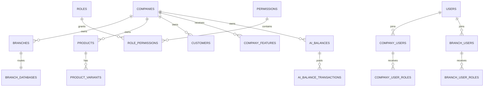

# Thiết kế schema database tổng `[ttsmart.com.vn]`

> **Quyết định hiện hành ngày 2026-08-24:** `[ttsmart.com.vn]` chỉ là Platform DB. Mỗi Company có Company DB riêng chứa Product Master/dữ liệu dùng chung và mỗi Branch có Branch DB riêng chứa giao dịch/tồn kho. Mọi nội dung bên dưới đặt sản phẩm/khách hàng gốc trong database tổng hoặc phủ nhận Company DB là thiết kế lịch sử, không còn authoritative. Xem `../architecture/SQLSERVER_TARGET_ARCHITECTURE.md`.

> Cập nhật ownership ngày 2026-08-14: chủ dự án xác nhận `[TTSmart]` là database bán hàng đầy đủ; mỗi chi nhánh có tồn kho/chứng từ riêng, có thể có catalog riêng và ưu tiên cài local/cô lập dữ liệu. Phần control-plane/identity/feature/provisioning vẫn áp dụng, nhưng database tổng không còn ownership Product master. Các bảng catalog/customer đã tạo hiện chưa có dữ liệu nghiệp vụ và chưa được drop hoặc sửa trong lượt khảo sát này. Xem `SQLSERVER_TTSMART_SCHEMA_DESIGN.md`.

## 1. Vai trò và ranh giới

`[ttsmart.com.vn]` là database tổng duy nhất. Database này giữ dữ liệu quản lý chung và dữ liệu gốc dùng chung theo công ty:

- công ty, chi nhánh và thông tin database;
- tài khoản người dùng và quyền;
- tính năng được cấp và số dư/lịch sử AI;
- sản phẩm/khách hàng gốc theo `CompanyId`;
- tạo database, phiên bản bảng, kiểm tra kết nối và khác biệt cấu trúc;
- phiên hỗ trợ, nhật ký, đồng bộ và thông tin chuyển dữ liệu.

Không đặt trong database tổng:

- tồn kho, lịch sử tăng giảm tồn, đơn bán và phiếu nhập/xuất của chi nhánh;
- Station, storefront và cấu hình riêng TTSmart — thuộc `[TTSmart]`;
- password, connection string hoặc provider token dạng đọc được;
- file upload nhị phân;
- bảng Core riêng của một chi nhánh.

### Danh sách nhanh

```text
Công ty:     Companies, Branches, CompanySettings
Database:    DatabaseServers, TtsmartDatabase, BranchDatabases, DatabaseJobs
Tài khoản:   Users, UserPasswords, UserLogins, UserSessions, SuperAdmins
Quyền:       CompanyUsers, BranchUsers, Roles, Permissions, RolePermissions
Tính năng:   Features, CompanyFeatures, BranchFeatures, CompanyFeatureSettings
Sản phẩm:    Products, ProductVariants, Brands, ProductTypes, Categories, PriceLists, BranchPrices
Khách hàng:  Customers, CustomerContacts, CustomerAddresses
AI:          AiBalances, AiTransactions, AiReservations, AiUsageLogs
Hỗ trợ:      SupportSessions, SupportPermissions, SupportActions
Nhật ký:     SystemAuditLogs, SecurityLogs
Đồng bộ:     OutboxMessages, InboxMessages, BranchSyncStates, ProcessedRequests
Chuyển data: MigrationRuns, MigrationSteps, MongoIdMappings, MigrationErrors
```

Tất cả bảng vật lý dùng schema `dbo`. Các nhóm dưới đây chỉ để tài liệu dễ đọc, không phải SQL schema riêng.

```text
dbo.Companies
dbo.Branches
dbo.BranchDatabases
dbo.Users
dbo.Roles
dbo.CompanyFeatures
dbo.Products
dbo.Customers
dbo.AiBalances
dbo.SupportSessions
dbo.SystemAuditLogs
dbo.MigrationRuns
```

## 2. Quy ước chung

- PK dùng `uniqueidentifier`, ưu tiên UUID v7 sinh từ application để giảm phân mảnh index.
- Thời gian dùng `datetimeoffset(7)` UTC.
- Tiền dùng `decimal(19,4)` kèm `CurrencyCode char(3)` khi có nhiều currency.
- Quantity không nằm trong database tổng, trừ metadata cấu hình; dữ liệu quantity nghiệp vụ thuộc BranchDb.
- Bảng mutable quan trọng dùng `rowversion`.
- Code business có cột raw và normalized; unique index đặt trên normalized scope.
- Soft delete chỉ dùng cho master/config cần giữ tham chiếu; ledger/audit không update/delete.
- JSON chỉ dùng cho cấu hình thay đổi theo feature và phải có `CHECK (ISJSON(...) = 1)`; không dùng JSON thay cho quan hệ Core.
- Không tạo FK xuyên `[ttsmart.com.vn]`, `[TTSmart]` và `[{BranchCode}_online]`.
- Mọi secret chỉ tồn tại trong secret manager; SQL chỉ giữ `SecretReferenceId`.

Các cột audit chung khi phù hợp:

```text
CreatedAt, CreatedByUserId
UpdatedAt, UpdatedByUserId
DeletedAt, DeletedByUserId
RowVersion
```

## 3. Quan hệ cấp cao



## 4. Công ty và chi nhánh

### 4.1 `dbo.Companies`

Nguồn sự thật về công ty/tenant.

| Cột | Kiểu | Quy tắc |
|---|---|---|
| `CompanyId` | uniqueidentifier | PK |
| `CompanyCode` | nvarchar(64) | mã do SupAdmin nhập, không đổi theo tên |
| `NormalizedCompanyCode` | nvarchar(64) | uppercase/trim, unique |
| `LegalName` | nvarchar(300) | tên pháp nhân |
| `DisplayName` | nvarchar(300) | tên hiển thị |
| `TaxCode` | nvarchar(64) null | filtered index; policy unique cần owner chốt |
| `RepresentativeName` | nvarchar(200) null | người đại diện |
| `ContactName` | nvarchar(200) null | liên hệ chính |
| `ContactEmail` | nvarchar(320) null | normalized riêng nếu cần tìm kiếm |
| `ContactPhone` | nvarchar(32) null | không dùng làm PK |
| `AddressLine` | nvarchar(1000) null | địa chỉ pháp nhân |
| `CountryCode` | char(2) null | ISO country |
| `TimezoneId` | nvarchar(100) | timezone mặc định |
| `Status` | tinyint | Pending/Active/Suspended/Closed |
| `ServiceStartsAt` | datetimeoffset null | trạng thái dịch vụ |
| `ServiceEndsAt` | datetimeoffset null | không đồng nghĩa billing subscription |
| audit columns |  | created/updated/rowversion |

Constraint/index:

- unique `NormalizedCompanyCode`;
- index `(Status, DisplayName)`;
- filtered index `TaxCode IS NOT NULL` nếu owner chốt uniqueness.

### 4.2 `dbo.Branches`

Thông tin cơ bản của chi nhánh, không chứa credential database.

| Cột | Kiểu | Quy tắc |
|---|---|---|
| `BranchId` | uniqueidentifier | PK |
| `CompanyId` | uniqueidentifier | FK `Companies` |
| `BranchCode` | nvarchar(64) | mã ổn định trong Company |
| `NormalizedBranchCode` | nvarchar(64) | uppercase/trim |
| `Name` | nvarchar(300) | tên hiển thị |
| `IsHeadOffice` | bit | trụ sở chính |
| `Email` | nvarchar(320) null | liên hệ |
| `Phone` | nvarchar(32) null | liên hệ |
| `AddressLine` | nvarchar(1000) null | địa chỉ |
| `ProvinceCode` | nvarchar(32) null | mã vùng hành chính nếu dùng |
| `Latitude`/`Longitude` | decimal(9,6) null | không dùng varchar |
| `TimezoneId` | nvarchar(100) | timezone chi nhánh |
| `Status` | tinyint | PendingDatabaseSetup/Active/Suspended/Closed |
| audit columns |  | created/updated/rowversion |

Constraint/index:

- unique `(CompanyId, NormalizedBranchCode)`;
- filtered unique `(CompanyId, IsHeadOffice)` khi `IsHeadOffice = 1`;
- index `(CompanyId, Status)`.

### 4.3 `dbo.CompanySettings`

Chỉ giữ cấu hình dùng chung trong Company, không chứa secret.

| Cột | Kiểu |
|---|---|
| `CompanySettingId` | uniqueidentifier PK |
| `CompanyId` | uniqueidentifier FK/unique |
| `DefaultCurrencyCode` | char(3) |
| `DefaultLocale` | nvarchar(20) |
| `DefaultTimezoneId` | nvarchar(100) |
| `SettingsJson` | nvarchar(max), JSON hợp lệ |
| `ConfigurationVersion` | int |
| audit/rowversion |  |

Không đưa workflow kho/đơn cụ thể của Branch vào bảng này; cấu hình vận hành đó nằm trong BranchDb.

## 5. Database và secret

### 5.1 `dbo.SecretReferences`

Metadata trỏ tới secret manager, không phải secret.

| Cột | Kiểu | Quy tắc |
|---|---|---|
| `SecretReferenceId` | uniqueidentifier | PK |
| `ProviderType` | tinyint | WindowsCredential/AzureKeyVault/EncryptedFile/... |
| `ExternalKey` | nvarchar(500) | tên/path reference, không chứa secret value |
| `Purpose` | tinyint | BranchRuntime/DatabaseSetup/SMTP/Provider/... |
| `Status` | tinyint | Active/Rotating/Revoked |
| `Version` | int | phiên bản metadata |
| `LastRotatedAt` | datetimeoffset null |  |
| audit/rowversion |  |  |

### 5.2 `dbo.DatabaseServers`

Danh mục server alias; không lưu connection string.

| Cột | Kiểu |
|---|---|
| `DatabaseServerId` | uniqueidentifier PK |
| `ServerAlias` | nvarchar(100), unique |
| `EngineType` | tinyint, SQL Server |
| `Environment` | tinyint, Development/Staging/Production |
| `Status` | tinyint |
| `SetupSecretReferenceId` | uniqueidentifier FK `SecretReferences` null |
| `LastHealthCheckAt` | datetimeoffset null |
| audit/rowversion |  |

Hostname/instance có thể được resolve qua cấu hình hạ tầng từ `ServerAlias`; không nhận server name từ request tạo Branch.

### 5.3 `dbo.TtsmartDatabase`

Thông tin kết nối một dòng cho database `[TTSmart]`.

| Cột | Kiểu |
|---|---|
| `TtsmartDatabaseId` | uniqueidentifier PK |
| `SingletonKey` | tinyint, CHECK = 1, unique |
| `DatabaseServerId` | uniqueidentifier FK |
| `DatabaseName` | nvarchar(128), giá trị chuẩn `TTSmart` |
| `LoginAlias` | nvarchar(128) |
| `SecretReferenceId` | uniqueidentifier FK |
| `SchemaVersion` | nvarchar(64) |
| `Status` | tinyint |
| `LastHealthCheckAt` | datetimeoffset null |
| audit/rowversion |  |

### 5.4 `dbo.BranchDatabases`

Tách khỏi `Branches` để không trộn thông tin nghiệp vụ và connection routing.

| Cột | Kiểu | Quy tắc |
|---|---|---|
| `BranchDatabaseId` | uniqueidentifier | PK |
| `BranchId` | uniqueidentifier | FK/unique, 1:1 với Branch |
| `DatabaseServerId` | uniqueidentifier | FK |
| `DatabaseName` | nvarchar(128) | từ textbox; allowlist; suffix `_online` |
| `NormalizedDatabaseName` | nvarchar(128) | unique toàn registry |
| `LoginAlias` | nvarchar(128) | sinh server-side từ BranchId |
| `SecretReferenceId` | uniqueidentifier | FK, password không nằm trong bảng |
| `TemplateId` | uniqueidentifier | định danh BranchDbTemplate |
| `SchemaVersion` | nvarchar(64) | version đã áp dụng |
| `SetupStatus` | tinyint | Pending/Creating/Migrating/Seeding/Validating/Active/Failed |
| `LastHealthCheckAt` | datetimeoffset null |  |
| `LastValidatedAt` | datetimeoffset null |  |
| `FailureCode` | nvarchar(100) null | mã lỗi ổn định, không chứa secret |
| audit/rowversion |  |  |

Không có cột `Password`, `ConnectionString`, `ServerPassword` hoặc provider token.

### 5.5 `dbo.DatabaseJobs`

| Cột | Kiểu |
|---|---|
| `SetupJobId` | uniqueidentifier PK |
| `BranchId` | uniqueidentifier FK null |
| `TargetDatabaseId` | uniqueidentifier |
| `OperationType` | tinyint, Create/Upgrade/RotateCredential/Validate/Deactivate |
| `Status` | tinyint |
| `IdempotencyKey` | nvarchar(128), unique |
| `RequestedByUserId` | uniqueidentifier |
| `RequestedAt`/`StartedAt`/`FinishedAt` | datetimeoffset |
| `AttemptCount` | int |
| `CurrentStep` | nvarchar(100) null |
| `FailureCode` | nvarchar(100) null |
| `FailureSummary` | nvarchar(1000) null, đã redact |
| `CorrelationId` | uniqueidentifier |
| rowversion |  |

Job không chứa `DatabasePassword`; worker resolve secret qua `SecretReferenceId`.

### 5.6 `dbo.DatabaseJobSteps`

Theo dõi từng bước để retry/xử lý failure xác định.

| Cột | Kiểu |
|---|---|
| `SetupStepId` | uniqueidentifier PK |
| `SetupJobId` | uniqueidentifier FK |
| `StepName` | nvarchar(100) |
| `Sequence` | int |
| `Status` | tinyint |
| `StartedAt`/`FinishedAt` | datetimeoffset null |
| `AttemptCount` | int |
| `ErrorCode` | nvarchar(100) null |
| `SafeErrorDetail` | nvarchar(1000) null |

Unique `(SetupJobId, Sequence)`.

### 5.7 `dbo.DatabaseSchemaVersions`

Lịch sử version kỳ vọng/đã triển khai.

| Cột | Kiểu |
|---|---|
| `SchemaVersionId` | uniqueidentifier PK |
| `TemplateId` | uniqueidentifier |
| `Version` | nvarchar(64) |
| `MigrationName` | nvarchar(300) |
| `SchemaChecksum` | char(64) |
| `ReleasedAt` | datetimeoffset |
| `IsCurrent` | bit |

### 5.8 `dbo.DatabaseHealthChecks`

| Cột | Kiểu |
|---|---|
| `HealthCheckId` | bigint identity PK |
| `BranchDatabaseId` | uniqueidentifier FK null |
| `TtsmartDatabaseId` | uniqueidentifier FK null |
| `CheckedAt` | datetimeoffset |
| `Status` | tinyint |
| `LatencyMs` | int null |
| `ObservedSchemaVersion` | nvarchar(64) null |
| `ErrorCode` | nvarchar(100) null |

Không ghi hostname, password hoặc connection string vào error detail.

CHECK constraint bắt buộc đúng một trong hai registry ID có giá trị, tránh polymorphic ID không được FK bảo vệ.

### 5.9 `dbo.DatabaseSchemaDiffs`

| Cột | Kiểu |
|---|---|
| `SchemaDifferenceId` | uniqueidentifier PK |
| `BranchDatabaseId` | uniqueidentifier FK |
| `ExpectedSchemaVersion`/`ObservedSchemaVersion` | nvarchar(64) |
| `ExpectedChecksum`/`ObservedChecksum` | char(64) |
| `DriftStatus` | tinyint |
| `DetectedAt`/`ResolvedAt` | datetimeoffset null |
| `SummaryJson` | nvarchar(max), JSON đã allowlist |

## 6. Tài khoản

### 6.1 `dbo.Users`

Tài khoản đăng nhập dùng chung toàn hệ thống; không nhúng role hoặc Branch dưới dạng chuỗi/mảng.

| Cột | Kiểu |
|---|---|
| `UserId` | uniqueidentifier PK |
| `DisplayName` | nvarchar(200) |
| `AccountType` | tinyint, Workforce/Customer/System |
| `Status` | tinyint, Pending/Active/Locked/Disabled |
| `PasswordChangedAt` | datetimeoffset null |
| `SecurityStamp` | uniqueidentifier |
| `LastLoginAt` | datetimeoffset null |
| audit/rowversion |  |

### 6.2 `dbo.UserPasswords`

| Cột | Kiểu |
|---|---|
| `PasswordId` | uniqueidentifier PK |
| `UserId` | uniqueidentifier FK/unique |
| `PasswordHash` | nvarchar(500) |
| `HashAlgorithm` | nvarchar(50), ví dụ bcrypt/argon2id |
| `HashVersion` | int |
| `MustRehash`/`MustChangePassword` | bit |
| `FailedAttemptCount` | int |
| `LockedUntil` | datetimeoffset null |
| audit/rowversion |  |

Giữ bcrypt legacy và rehash khi đăng nhập thành công; không lưu plaintext/reset OTP.

### 6.3 `dbo.UserLogins`

| Cột | Kiểu |
|---|---|
| `LoginId` | uniqueidentifier PK |
| `UserId` | uniqueidentifier FK |
| `IdentifierType` | tinyint, Phone/Email/UserName |
| `DisplayValue` | nvarchar(320) |
| `NormalizedValue` | nvarchar(320) |
| `IsPrimary`/`IsVerified` | bit |
| `VerifiedAt` | datetimeoffset null |

Unique `(IdentifierType, NormalizedValue)` nếu account là global identity; policy này phải được xác nhận trước DDL.

### 6.4 `dbo.UserSessions`

| Cột | Kiểu |
|---|---|
| `SessionId` | uniqueidentifier PK |
| `UserId` | uniqueidentifier FK |
| `TokenHash` | binary(32), unique |
| `IssuedAt`/`ExpiresAt` | datetimeoffset |
| `RevokedAt` | datetimeoffset null |
| `ReplacedBySessionId` | uniqueidentifier null |
| `DeviceLabel` | nvarchar(200) null |
| `IpAddressHash` | binary(32) null |
| `RevocationReason` | nvarchar(200) null |

Không migrate `logInString` hoặc autologin token thô.

### 6.5 `dbo.SuperAdmins`

Đánh dấu system principal, không dùng role nghiệp vụ.

| Cột | Kiểu |
|---|---|
| `SuperAdminId` | uniqueidentifier PK |
| `UserId` | uniqueidentifier FK/unique |
| `SingletonKey` | tinyint, CHECK = 1 |
| `Status` | tinyint |
| audit/rowversion |  |

Filtered unique `SingletonKey` cho bản ghi Active để bảo đảm trước mắt chỉ có một Super Admin.

## 7. Người dùng và quyền

### 7.1 `dbo.CompanyUsers`

| Cột | Kiểu |
|---|---|
| `CompanyUserId` | uniqueidentifier PK |
| `CompanyId` | uniqueidentifier FK |
| `UserId` | uniqueidentifier FK |
| `UserType` | tinyint, Owner/Employee/CustomerLink |
| `Status` | tinyint |
| `StartsAt`/`EndsAt` | datetimeoffset null |
| audit/rowversion |  |

Unique active `(CompanyId, UserId, UserType)`.

### 7.2 `dbo.BranchUsers`

| Cột | Kiểu |
|---|---|
| `BranchUserId` | uniqueidentifier PK |
| `BranchId` | uniqueidentifier FK |
| `UserId` | uniqueidentifier FK |
| `Status` | tinyint |
| `IsPrimaryBranch` | bit |
| `StartsAt`/`EndsAt` | datetimeoffset null |
| audit/rowversion |  |

Unique active `(BranchId, UserId)`.

### 7.3 `dbo.Roles`

| Cột | Kiểu |
|---|---|
| `RoleId` | uniqueidentifier PK |
| `CompanyId` | uniqueidentifier FK null cho template hệ thống |
| `RoleCode`/`NormalizedRoleCode` | nvarchar(100) |
| `Name` | nvarchar(200) |
| `ScopeType` | tinyint, Company/Branch |
| `IsSystemTemplate` | bit |
| `Status` | tinyint |
| audit/rowversion |  |

Unique `(CompanyId, ScopeType, NormalizedRoleCode)`.

### 7.4 `dbo.Permissions`

Danh mục permission nguyên tử do platform quản lý.

| Cột | Kiểu |
|---|---|
| `PermissionId` | uniqueidentifier PK |
| `PermissionCode` | nvarchar(150), unique |
| `Name` | nvarchar(200) |
| `ModuleCode` | nvarchar(100) |
| `Description` | nvarchar(1000) null |
| `Status` | tinyint |

Ví dụ `PRODUCT.VIEW`, `INVENTORY.ADJUST`, `ORDER.APPROVE`; không lưu URL/menu làm permission source of truth.

### 7.5 `dbo.RolePermissions`

| Cột | Kiểu |
|---|---|
| `RolePermissionId` | uniqueidentifier PK |
| `RoleId` | uniqueidentifier FK |
| `PermissionId` | uniqueidentifier FK |
| `GrantedAt`/`GrantedByUserId` | datetimeoffset/uniqueidentifier |

Unique `(RoleId, PermissionId)`.

### 7.6 `dbo.CompanyUserRoles`

| Cột | Kiểu |
|---|---|
| `CompanyUserRoleId` | uniqueidentifier PK |
| `CompanyUserId` | uniqueidentifier FK |
| `RoleId` | uniqueidentifier FK |
| `StartsAt`/`EndsAt` | datetimeoffset null |

Unique active `(CompanyUserId, RoleId)`; Role phải có `ScopeType = Company`.

### 7.7 `dbo.BranchUserRoles`

Tương tự bảng Company role nhưng Role phải có `ScopeType = Branch`.

| Cột | Kiểu |
|---|---|
| `BranchUserRoleId` | uniqueidentifier PK |
| `BranchUserId` | uniqueidentifier FK |
| `RoleId` | uniqueidentifier FK |
| `StartsAt`/`EndsAt` | datetimeoffset null |

## 8. Tính năng

### 8.1 `dbo.Features`

| Cột | Kiểu |
|---|---|
| `FeatureId` | uniqueidentifier PK |
| `FeatureCode` | nvarchar(150), unique |
| `Name` | nvarchar(200) |
| `ScopeType` | tinyint, Company/Branch |
| `ModuleCode` | nvarchar(100) |
| `ConfigurationSchemaJson` | nvarchar(max) null |
| `Status` | tinyint |

### 8.2 `dbo.CompanyFeatures`

| Cột | Kiểu |
|---|---|
| `CompanyFeatureId` | uniqueidentifier PK |
| `CompanyId` | uniqueidentifier FK |
| `FeatureId` | uniqueidentifier FK |
| `Status` | tinyint |
| `ValidFrom`/`ValidTo` | datetimeoffset null |
| `GrantedByUserId` | uniqueidentifier |
| `Reason` | nvarchar(500) null |
| audit/rowversion |  |

Unique active `(CompanyId, FeatureId)`.

### 8.3 `dbo.BranchFeatures`

| Cột | Kiểu |
|---|---|
| `BranchFeatureId` | uniqueidentifier PK |
| `BranchId` | uniqueidentifier FK |
| `FeatureId` | uniqueidentifier FK |
| `State` | tinyint, Inherit/Enabled/Disabled |
| `Reason` | nvarchar(500) null |
| audit/rowversion |  |

Không thể Enabled nếu Company chưa có grant.

### 8.4 `dbo.CompanyFeatureSettings`

| Cột | Kiểu |
|---|---|
| `CompanyFeatureSettingId` | uniqueidentifier PK |
| `CompanyId` | uniqueidentifier FK |
| `FeatureId` | uniqueidentifier FK |
| `SettingsJson` | nvarchar(max), JSON hợp lệ |
| `Version` | int |
| audit/rowversion |  |

Backend validate JSON theo schema của Feature; không dùng table này để chứa secret.

### 8.5 `dbo.BranchFeatureSettings`

Tương tự Company settings nhưng có `BranchId`, dùng cho cấu hình riêng chi nhánh. Unique `(BranchId, FeatureId)`.

## 9. Sản phẩm

Mọi bảng master catalog bắt buộc scope `CompanyId`. BranchDb nhận projection qua outbox.

### 9.1 Bảng danh mục

| Bảng | Cột chính | Unique/index |
|---|---|---|
| `dbo.Brands` | BrandId, CompanyId, BrandCode, Name, Status, audit | unique `(CompanyId, NormalizedBrandCode)`; index normalized name |
| `dbo.ProductTypes` | ProductTypeId, CompanyId, TypeCode, Name, IconReference, Status | unique `(CompanyId, NormalizedTypeCode)` |
| `dbo.Categories` | CategoryId, CompanyId, ParentCategoryId, CategoryCode, Name, SortOrder, Status | unique `(CompanyId, NormalizedCategoryCode)`; index parent |
| `dbo.Units` | UnitId, CompanyId, UnitCode, Name, DecimalScale, Status | unique `(CompanyId, NormalizedUnitCode)` |
| `dbo.ProductAttributes` | ProductAttributeId, CompanyId, AttributeCode, Name, DataType, IsVariantAxis, Status | unique `(CompanyId, NormalizedAttributeCode)` |
| `dbo.ProductAttributeValues` | ProductAttributeValueId, ProductAttributeId, ValueCode, DisplayValue, SortOrder, Status | unique `(ProductAttributeId, NormalizedValueCode)` |

`LegacyCatalogAliases` giữ alias/raw string trong thời gian migration, không biến alias thành dimension mới một cách âm thầm.

### 9.2 `dbo.Products`

| Cột | Kiểu |
|---|---|
| `ProductId` | uniqueidentifier PK |
| `CompanyId` | uniqueidentifier FK |
| `ProductCode`/`NormalizedProductCode` | nvarchar(100) null |
| `Name`/`NormalizedName` | nvarchar(500) |
| `BrandId` | uniqueidentifier FK null |
| `ProductTypeId` | uniqueidentifier FK null |
| `DefaultUnitId` | uniqueidentifier FK |
| `WarrantyText` | nvarchar(1000) null |
| `Description` | nvarchar(max) null |
| `DisplayState` | tinyint |
| `Status` | tinyint |
| `LegacyMongoId` | char(24) null |
| audit/rowversion |  |

Constraint/index:

- filtered unique `(CompanyId, NormalizedProductCode)` khi code không null;
- không unique Product name;
- index `(CompanyId, NormalizedName)`, `(CompanyId, ProductTypeId)`, `(CompanyId, BrandId)`;
- filtered unique `LegacyMongoId` cho migration TTSmart.

### 9.3 `dbo.ProductVariants`

| Cột | Kiểu |
|---|---|
| `ProductVariantId` | uniqueidentifier PK |
| `ProductId` | uniqueidentifier FK |
| `CompanyId` | uniqueidentifier FK, denormalized để enforce scope/SKU |
| `Sku`/`NormalizedSku` | nvarchar(150) null |
| `VariantName` | nvarchar(300) null |
| `UnitId` | uniqueidentifier FK |
| `DefaultVatRate` | decimal(9,6) null |
| `Status` | tinyint |
| `LegacyMongoSubdocumentId` | char(24) null |
| audit/rowversion |  |

Unique SKU dùng `(CompanyId, NormalizedSku)`; trigger/application validation phải bảo đảm `CompanyId` của Variant khớp Product, hoặc dùng composite FK `(ProductId, CompanyId)`.

### 9.4 Các bảng liên kết Product

| Bảng | Mục đích |
|---|---|
| `dbo.ProductCategories` | many-to-many Product–Category, unique pair |
| `dbo.VariantAttributes` | Variant–ProductAttributeValue, unique theo Variant/Attribute |
| `dbo.ProductCodes` | barcode/vendor/internal code; unique theo Company/CodeType/NormalizedCode |
| `dbo.ProductMedia` | metadata URL/object key/checksum/sort, không chứa binary |
| `dbo.ProductDocuments` | label, object key, MIME, checksum, source type |
| `dbo.LegacyCatalogAliases` | map raw brand/type/section/value sang dimension chuẩn |

### 9.5 Giá dùng chung và giá chi nhánh

| Bảng | Cột chính |
|---|---|
| `dbo.PriceLists` | PriceListId, CompanyId, Code, Name, CurrencyCode, ValidFrom/To, Status, rowversion |
| `dbo.PriceListItems` | PriceListItemId, PriceListId, ProductVariantId, UnitPrice decimal(19,4), VatRate, effective time |
| `dbo.BranchPrices` | BranchPriceId, BranchId, ProductVariantId, UnitPrice, VatRate, ValidFrom/To, Status, rowversion |

BranchPriceOverrides là nguồn master ở tổng và được project xuống `[{BranchCode}_online]`; transaction chi nhánh dùng giá projection cục bộ.

## 10. Khách hàng

### 10.1 `dbo.Customers`

| Cột | Kiểu |
|---|---|
| `CustomerId` | uniqueidentifier PK |
| `CompanyId` | uniqueidentifier FK |
| `CustomerCode`/`NormalizedCustomerCode` | nvarchar(100) |
| `CustomerType` | tinyint, Individual/Organization |
| `DisplayName` | nvarchar(300) |
| `TaxCode` | nvarchar(64) null |
| `LinkedUserId` | uniqueidentifier FK null |
| `Status` | tinyint |
| `LegacyMongoUserId` | char(24) null |
| audit/rowversion |  |

Unique `(CompanyId, NormalizedCustomerCode)`. Phone/email không mặc định unique cho tới khi owner chốt rule merge.

### 10.2 Các bảng Customer phụ

| Bảng | Cột/mục đích chính |
|---|---|
| `dbo.CustomerIds` | CustomerId, IdType, NormalizedValue, IsVerified; unique theo policy |
| `dbo.CustomerContacts` | CustomerId, ContactType, DisplayValue, NormalizedValue, IsPrimary, IsVerified |
| `dbo.CustomerAddresses` | CustomerId, label/receiver/contact/address/province, IsDefault, audit |
| `dbo.CustomerConsents` | CustomerId, ConsentType, Granted/RevokedAt, Source, policy version |
| `dbo.CustomerMerges` | source/target CustomerId, reason, actor, time; append-only |

Branch-specific customer code, hạn mức và ghi chú vận hành nằm trong `CustomerBranchProfiles` của BranchDb, không ở database tổng.

## 11. AI

### 11.1 `dbo.AiBalances`

| Cột | Kiểu |
|---|---|
| `AiBalanceId` | uniqueidentifier PK |
| `CompanyId` | uniqueidentifier FK |
| `BranchId` | uniqueidentifier FK null |
| `AiType` | tinyint, AI_IMAGE_SCAN/AI_VOICE |
| `Balance` | bigint |
| `ReservedBalance` | bigint |
| `Status` | tinyint |
| rowversion |  |

Hai filtered unique index: `(CompanyId, AiType) WHERE BranchId IS NULL` cho số dư Company và `(CompanyId, BranchId, AiType) WHERE BranchId IS NOT NULL` cho số dư Branch.

### 11.2 `dbo.AiTransactions`

Ledger append-only.

| Cột | Kiểu |
|---|---|
| `AiTransactionId` | uniqueidentifier PK |
| `AiBalanceId` | uniqueidentifier FK |
| `Amount` | bigint signed |
| `TransactionType` | tinyint |
| `ReasonCode` | nvarchar(100) |
| `ReferenceType`/`ReferenceId` | nvarchar(100)/uniqueidentifier null |
| `IdempotencyKey` | nvarchar(128), unique |
| `ActorUserId` | uniqueidentifier null |
| `CreatedAt` | datetimeoffset |

### 11.3 `dbo.AiReservations`

Giữ lượt trong lúc tác vụ provider chạy.

| Cột | Kiểu |
|---|---|
| `AiReservationId` | uniqueidentifier PK |
| `AiBalanceId` | uniqueidentifier FK |
| `Amount` | bigint positive |
| `IdempotencyKey` | nvarchar(128), unique |
| `Status` | tinyint, Reserved/Consumed/Released/Expired |
| `ExpiresAt` | datetimeoffset |
| `ConsumedTransactionId` | uniqueidentifier null |

### 11.4 `dbo.AiUsageLogs`

Đối soát provider mà không lưu prompt/payload nhạy cảm.

| Cột | Kiểu |
|---|---|
| `AiUsageLogId` | uniqueidentifier PK |
| `CompanyId`/`BranchId` | uniqueidentifier/null |
| `AiType` | tinyint |
| `ProviderCode`/`ModelCode` | nvarchar(100) |
| `ProviderRequestHash` | binary(32) null |
| `Units` | bigint |
| `Status` | tinyint |
| `CorrelationId` | uniqueidentifier |
| `OccurredAt` | datetimeoffset |

## 12. Hỗ trợ

### 12.1 `dbo.SupportSessions`

| Cột | Kiểu |
|---|---|
| `SupportSessionId` | uniqueidentifier PK |
| `SystemAdministratorId` | uniqueidentifier FK |
| `CompanyId` | uniqueidentifier FK |
| `BranchId` | uniqueidentifier FK null |
| `Mode` | tinyint, ReadOnly/Support/Emergency |
| `Reason` | nvarchar(1000) |
| `Status` | tinyint |
| `StartedAt`/`ExpiresAt`/`EndedAt` | datetimeoffset null |
| `ReauthenticatedAt` | datetimeoffset null |
| `CorrelationId` | uniqueidentifier |

### 12.2 `dbo.SupportPermissions`

| Cột | Kiểu |
|---|---|
| `SupportPermissionId` | uniqueidentifier PK |
| `SupportSessionId` | uniqueidentifier FK |
| `PermissionId` | uniqueidentifier FK |
| `AccessMode` | tinyint, Read/Write |

### 12.3 `dbo.SupportActions`

Append-only record của thao tác trong phiên hỗ trợ.

| Cột | Kiểu |
|---|---|
| `SupportActionId` | uniqueidentifier PK |
| `SupportSessionId` | uniqueidentifier FK |
| `TargetDatabaseType`/`TargetDatabaseId` | tinyint/uniqueidentifier |
| `ActionCode` | nvarchar(150) |
| `TargetType`/`TargetId` | nvarchar(150)/nvarchar(200) |
| `BeforeHash`/`AfterHash` | binary(32) null |
| `OccurredAt` | datetimeoffset |
| `CorrelationId` | uniqueidentifier |

Không đưa raw customer payload hoặc secret vào bảng này.

## 13. Nhật ký

### 13.1 `dbo.SystemAuditLogs`

Append-only audit cho thay đổi Company/Branch/user/role/feature/AI/database.

| Cột | Kiểu |
|---|---|
| `SystemAuditLogId` | bigint identity PK |
| `ActorUserId` | uniqueidentifier null |
| `ActorType` | tinyint |
| `ActionCode` | nvarchar(150) |
| `TargetType` | nvarchar(150) |
| `TargetId` | nvarchar(200) null |
| `CompanyId`/`BranchId` | uniqueidentifier null |
| `Outcome` | tinyint |
| `SafeMetadataJson` | nvarchar(max) null |
| `CorrelationId` | uniqueidentifier |
| `OccurredAt` | datetimeoffset |

Index `(OccurredAt)`, `(CompanyId, OccurredAt)`, `(ActorUserId, OccurredAt)`, `(CorrelationId)`; partition/retention theo thời gian.

### 13.2 `dbo.SecurityLogs`

| Cột | Kiểu |
|---|---|
| `SecurityLogId` | bigint identity PK |
| `UserId` | uniqueidentifier null |
| `EventCode` | nvarchar(150) |
| `Severity` | tinyint |
| `Outcome` | tinyint |
| `IpAddressHash`/`UserAgentHash` | binary(32) null |
| `CorrelationId` | uniqueidentifier |
| `OccurredAt` | datetimeoffset |
| `SafeMetadataJson` | nvarchar(max) null |

## 14. Đồng bộ

### 14.1 `dbo.OutboxMessages`

| Cột | Kiểu |
|---|---|
| `OutboxMessageId` | uniqueidentifier PK |
| `AggregateType`/`AggregateId` | nvarchar(100)/uniqueidentifier |
| `EventType` | nvarchar(200) |
| `SchemaVersion` | int |
| `PayloadJson` | nvarchar(max), JSON allowlist |
| `IdempotencyKey` | nvarchar(128), unique |
| `OccurredAt` | datetimeoffset |
| `Status` | tinyint |
| `AttemptCount` | int |
| `NextAttemptAt` | datetimeoffset null |
| `ProcessedAt` | datetimeoffset null |
| `CorrelationId` | uniqueidentifier |

Product/Customer/price/feature thay đổi phải ghi outbox trong cùng local transaction.

### 14.2 `dbo.InboxMessages`

Dedupe event từ `[TTSmart]` hoặc BranchDb.

| Cột | Kiểu |
|---|---|
| `InboxMessageId` | uniqueidentifier PK |
| `SourceDatabaseId` | uniqueidentifier |
| `MessageId` | uniqueidentifier |
| `MessageType` | nvarchar(200) |
| `ReceivedAt`/`ProcessedAt` | datetimeoffset null |
| `Status` | tinyint |
| `ErrorCode` | nvarchar(100) null |

Unique `(SourceDatabaseId, MessageId)`.

### 14.3 `dbo.BranchSyncStates`

| Cột | Kiểu |
|---|---|
| `BranchSyncStateId` | uniqueidentifier PK |
| `BranchId` | uniqueidentifier FK |
| `SyncType` | nvarchar(100), Product/Customer/Price/Feature |
| `LastSequence` | bigint |
| `LastSyncedAt` | datetimeoffset null |
| `Status` | tinyint |
| `LastErrorCode` | nvarchar(100) null |
| rowversion |  |

### 14.4 `dbo.ProcessedRequests`

| Cột | Kiểu |
|---|---|
| `ProcessedRequestId` | uniqueidentifier PK |
| `Scope` | nvarchar(100) |
| `IdempotencyKey` | nvarchar(128) |
| `RequestHash` | binary(32) |
| `ResponseReference` | nvarchar(500) null |
| `Status` | tinyint |
| `ExpiresAt` | datetimeoffset |

Unique `(Scope, IdempotencyKey)`.

## 15. Chuyển dữ liệu

| Bảng | Mục đích/cột chính |
|---|---|
| `dbo.MigrationRuns` | RunId, source/target, version, status, start/end, actor, checksum |
| `dbo.MigrationSteps` | RunId, entity/collection, watermark, read/written/error count |
| `dbo.MongoIdMappings` | SourceCollection, MongoId, TargetTable, TargetId; unique source và target |
| `dbo.MigrationErrors` | RunId, entity, MongoId, ErrorCode, safe detail, status/owner |
| `dbo.MigrationChecks` | RunId, metric code, source/target value, difference, status, signed-off by/time |

Không lưu password, token, upload hoặc raw PII không cần thiết trong staging/exception.

## 16. Form tạo Company/Branch

### Tạo Company

Request tối thiểu:

```text
companyCode
legalName
displayName
taxCode
contactName/contactEmail/contactPhone
addressLine/timezoneId
```

Ghi `dbo.Companies` và audit; không tự tạo database Company vì kiến trúc không có CompanyDb.

### Tạo Branch

Request:

```text
companyId
branchCode
name
email/phone/addressLine/timezoneId
isHeadOffice
databaseName
databasePassword
```

Transaction HTTP chỉ:

1. validate Company/Branch code và `databaseName`;
2. tạo `dbo.Branches` ở trạng thái `PendingDatabaseSetup`;
3. ghi password vào secret manager;
4. tạo `dbo.SecretReferences`;
5. tạo `dbo.BranchDatabases` và `dbo.DatabaseJobs`;
6. commit rồi trả job/status, không trả password.

Worker sau đó tạo database/login/user, áp `BranchDbTemplate`, seed `DatabaseMetadata`, validate schema/connection và mới chuyển Branch sang `Active`.

Nếu transaction trước commit thất bại, secret tạm phải được cleanup. Nếu tạo database thất bại sau commit, giữ Branch và `BranchDatabases` ở `Failed`, redact lỗi và cho phép retry idempotent; không tạo lại BranchId/database name mới.

## 17. Bảng không đưa vào `[ttsmart.com.vn]`

| Nhóm | Database sở hữu |
|---|---|
| StockBalance/StockMovement/Warehouse | `[{BranchCode}_online]` |
| SalesOrder/ImportReceipt/ExportIssue | `[{BranchCode}_online]` |
| CustomerBranchProfile | `[{BranchCode}_online]` |
| Station/public link/Station–Product | `[TTSmart]` |
| Storefront/policy/home section | `[TTSmart]` |
| TTS cart/order-template/order attribution | `[TTSmart]` |
| Provider secret value | secret manager |
| Upload/media binary | object/file storage, SQL chỉ giữ reference |

## 18. Phạm vi triển khai

Thiết kế trong tài liệu này có cả các phương án dài hạn. Sau forward migration 008 ngày 2026-08-14, phạm vi vật lý của `[ttsmart.com.vn]` chỉ còn control-plane: identity/phân quyền, feature, AI metadata, provisioning, audit và lịch sử schema. Catalog/customer đã được loại khỏi database tổng; `[TTSmart]` được tạo riêng làm database bán hàng. Bảng đồng bộ, migration dữ liệu, support và database branch không thuộc lần triển khai này.

Danh sách bảng vật lý, quyết định ràng buộc cùng-company, đường dẫn script và bằng chứng metadata nằm tại [SQLSERVER_TTSMART_COM_VN_DDL_IMPLEMENTATION.md](SQLSERVER_TTSMART_COM_VN_DDL_IMPLEMENTATION.md). Tài liệu triển khai đó là nguồn sự thật cho schema đã materialize; các phần dài hạn trong tài liệu này không được hiểu là DDL đã tạo.
